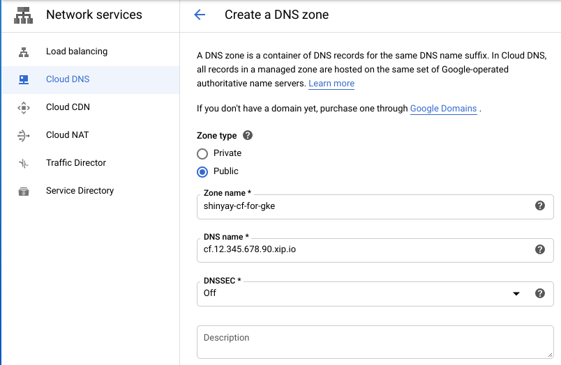

# Cloud Foundry for GKE Getting Started

Deploy Cloud Foundry on GKE

## Description

Cloud Foundry Components run on Kubernetes (GKE).


### Prerequiste CLI
- cf
  - [cloudfoundry/cli](https://github.com/cloudfoundry/cli)
- bosh
  - [cloudfoundry/bosh-cli](https://github.com/cloudfoundry/bosh-cli)
- ytt
  - [k14s/ytt](https://github.com/k14s/ytt)
- kapp
  - [k14s/kapp](https://github.com/k14s/kapp)

Add CLIs to PATH after downloading above.

- [`script/install-cli.fish `](script/install-cli.fish)

### Create GKE Cluster

### Create Static IP address

### Create DNS Record



### Configure Cloud Foundry

```
$ cd cf-for-k8s
$ mkdir -p config-values tmp 
$ ./hack/generate-values.sh -d <YOUR_DOMAIN_NAME> > config-values/cf-values.yml
```

#### Configure Static IP Address

- `cf-for-k8s/config-values/static-ip.yml`

```yaml
#@data/values
---
istio_static_ip: <YOUR_STATIC_IP>
```

### Create Service Account

### Google Container Registry Configuration

- `cf-for-k8s/config-values/app-registry.yml`

```yaml
#@data/values
---
app_registry:
   hostname: gcr.io
   repository_prefix: gcr.io/<GCP_PROJECT_ID>/cf-workloads
   username: _json_key
   password: |
   <CONTENTS_of_SERVICE_ACCOUNT_JSON>
```

### Build Cloud Foundry Configuration

```
$ cd cf-for-k8s
$ ytt -f config -f config-values > config-values/cf-for-k8s-rendered.yml
```

### Deploy Cloud Foundry on GKE

```
$ cd cf-for-k8s
$ kapp deploy -a cf -f config-values/cf-for-k8s-rendered.yml -y
```

### Target cf cli to endpoint of Cloud Foundry on GKE

```
$ cf api --skip-ssl-validation https://api.<CF_SYSTEM_DOMAIN>
```

You can find <CF_SYSTEM_DOMAIN> at `system_domain` in `cf-values.yml`

### Login Cloud Foundry on GKE

```
$ cf auth admin <CF_ADMIN_PASSWORD>
```

You can find <CF_SYSTEM_DOMAIN> at `cf_admin_password` in `cf-values.yml`

### Create Org and Space

```
$ cf create-org test-org
$ cf create-space -o test-org test-space
$ cf target -o test-org -s test-space
```

### Deploy Test App

```
$ cd cf-for-k8s
$ cf push test-node-app -p tests/smoke/assets/test-node-app
```


## Demo

## Features

- feature:1
- feature:2

## Requirement

## Usage

## Installation

## Licence

Released under the [MIT license](https://gist.githubusercontent.com/shinyay/56e54ee4c0e22db8211e05e70a63247e/raw/34c6fdd50d54aa8e23560c296424aeb61599aa71/LICENSE)

## Author

[shinyay](https://github.com/shinyay)
